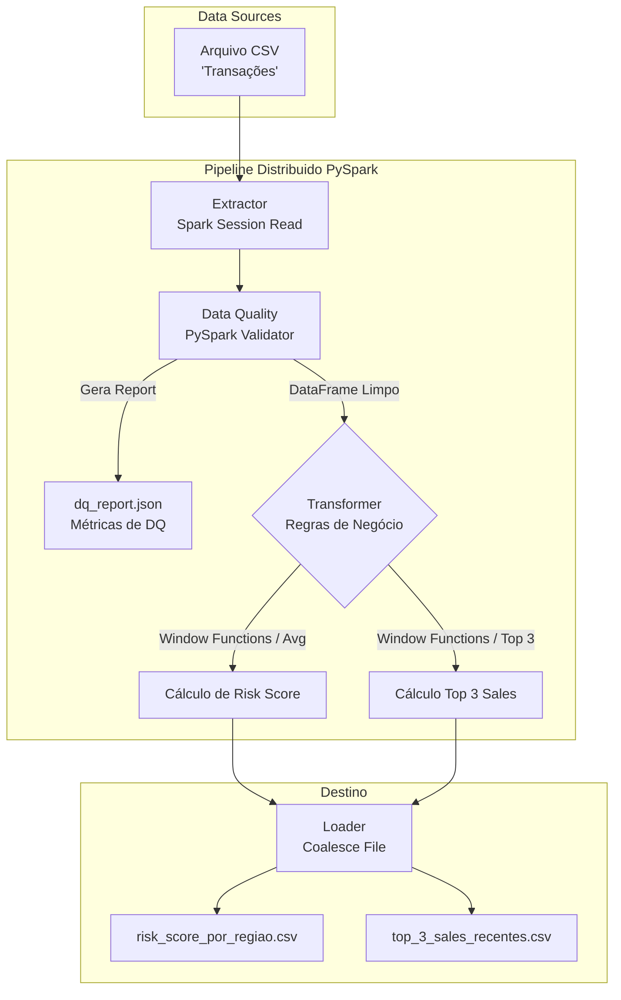
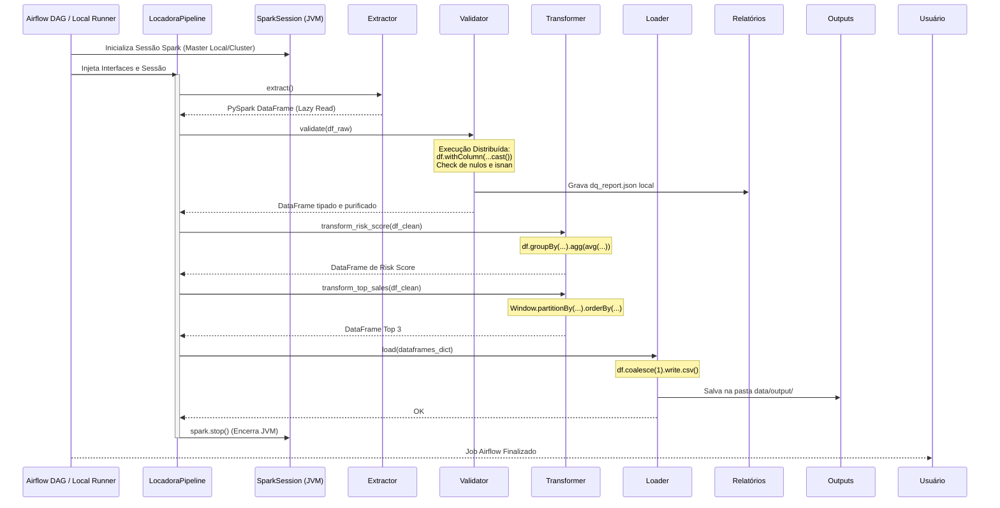

# 🚗 Locadora de Carros - Data Pipeline (PySpark)

Este projeto é uma solução completa de **Engenharia de Dados** desenvolvida para realizar a extração, limpeza, transformação e carga (ELT/ETL) de dados transacionais de uma locadora de carros. 

Nesta versão, a arquitetura foi evoluída para **Big Data**. Todo o motor de processamento, antes em Pandas, foi refatorado para utilizar **Apache Spark (PySpark)**, provendo paralelismo e tolerância a falhas. A infraestrutura continua conteinerizada via **Docker** e a orquestração (agora injetando e manipulando instâncias da JVM) é feita via **Apache Airflow**.

---

## 📊 Fontes de Dados e Saídas

### 📥 A Fonte de Dados (Input)
O pipeline ingere os dados a partir de um arquivo `CSV` compactado físico e versionado neste repositório em `data/input/df_fraud_credit.csv.gz`. O PySpark possui capacidade nativa de leitura de zips.
As principais colunas utilizadas no processamento são:
- `timestamp`: A data e hora em epoch que a transação ocorreu.
- `transaction_type`: A natureza da transação (ex: `sale` para vendas, `rent` para aluguel).
- `receiving_address`: O endereço ou identificador único do recebedor (cliente/agência).
- `amount`: O valor financeiro da transação.
- `location_region`: A região geográfica onde a transação aconteceu (ex: SP, RJ, Norte).
- `risk_score`: Uma pontuação de risco atribuída à transação (numérico).

### 📤 Os Produtos de Dados (Output)
Os dados são exportados via o método `df.coalesce(1).write.csv()` do Spark para a pasta `data/output/`.

1. **`risk_score_por_regiao.csv` (Tabela Analítica 1)**
   - Agrega o nível de risco médio por região (`location_region`).
2. **`top_3_sales_recentes.csv` (Tabela Analítica 2)**
   - Ranking de alto valor calculado de maneira distribuída utilizando **Window Functions** do PySpark particionando por `receiving address`, filtrando "sales" recentes e buscando o Top 3 financeiro (`amount`).
3. **`dq_report.json` (Relatório de Conformidade)**
   - Um payload JSON apontando total de linhas, nulos por coluna, registros rejeitados e o percentual de saúde dos dados (`qtd erros / qtd total`).

---

## 🔄 Condução do Processo ELT (SRP e PySpark)

1. **Extract (Extração):** O `CSVExtractor` recebe uma `SparkSession` e faz a leitura lazily do disco distribuído (ou local).
2. **Data Quality & Cleansing:** O `PySparkDataQualityValidator` aplica funções de tipagem restrita (`cast`) e `isnan/isNull` de forma distribuída em todo o cluster. Nulos vitais são derrubados antes de prosseguir.
3. **Transform (Transformação de Negócio):** O `BusinessTransformer` é a camada analítica com agregações e `Window Functions` pesadas rodando na JVM.
4. **Load (Carga Final):** O `SparkCSVLoader` manipula os `part-000` nativos do Hadoop gerados no output para consolidá-los em um arquivo único finalizado.

---

## 🏗️ Diagramas da Arquitetura

### 1. Fluxo Funcional dos Dados (Mermaid)


### 2. Orquestração e Ciclo de Vida da JVM (Sequence Diagram)
Este diagrama foca na injeção de dependência e no controle da **SparkSession**, provando a orquestração ponta a ponta:



### Explicação Granular de Cada Etapa (PySpark Engine):
1. **Extractor (Leitura Distribuída):** O `CSVExtractor` não carrega o arquivo para a memória RAM bruta. Ele cria um ponteiro virtual (Lazy Evaluation) apontando para o disco via `spark.read.csv()`, inferindo o esquema nativamente. Se amanhã houver 1000 arquivos CSVs, ele lê todos simultaneamente em cluster.
2. **Validator (Quality & Cleanse):** Recebe o DataFrame PySpark e executa tipagem (`cast`) massiva em paralelo nas *tasks*. Através da API de colunas, verifica nulos e gera a "Taxa de Conformidade" exportada no Json. O *Drop* nativo isola transações sujas e salva a matemática financeira.
3. **Transformer (Business Logic):** Coração analítico. Não há uso de loopings custosos (`for`). 
   - Na Tabela 1, usamos `df.groupBy().agg(avg())`, delegando o cálculo da média por região pros nós de processamento da JVM.
   - Na Tabela 2, o ranqueamento de "vendas mais recentes" é solucionado sem gargalos utilizando `pyspark.sql.window.Window`. A base é particionada em memória RAM virtual por `receiving address`, filtrada pela linha mais nova e em seguida submetida a um limitador universal (Top 3) utilizando as otimizações do *Catalyst Optimizer* do Spark.
4. **Loader (Persistência):** O `SparkCSVLoader` recebe o ponteiro do trabalho finalizado. Como o Spark salva dados em dezenas de minúsculos arquivos (`part-000x`), utilizamos `.coalesce(1)` para forçar a junção no último nó e descarregar um único arquivo `.csv` final na pasta `data/output/`.

---

## 🚀 Como Rodar o Projeto

Nesta evolução focamos na flexibilidade. Você tem três maneiras de acionar este motor:

### Opção 1: Via Docker & Apache Airflow (Produção Recomendada)
Toda a orquestração ocorre isolada em contêineres. O Dockerfile instala o `default-jre-headless` (Java) e o `pyspark`, subindo o pipeline perfeitamente.
1. Na raiz, digite:
   ```bash
   docker-compose up -d --build
   ```
2. Abra seu navegador em `http://localhost:8080` (User: `airflow`, Pass: `airflow`).
3. Ative a DAG `locadora_pipeline_dag` e clique no "Play".

### Opção 2: Script Nativo PySpark (Desenvolvimento Simples Local)
Se você quer simular o processamento sem instalar o Docker ou se perder no Airflow, criei um script focado em instanciar a JVM local e rodar.
1. Crie seu ambiente local e instale as dependências:
   ```bash
   python3 -m venv venv
   source venv/bin/activate
   pip install -r requirements.txt
   ```
2. Execute o script nativo:
   ```bash
   python3 run_local_spark.py
   ```
*O script levantará a `SparkSession` na sua máquina, processará e guardará os arquivos no `/data`.*

### Opção 3: Suíte de Testes (Alta Confiabilidade e CI/CD)
O repositório é validado na nuvem via **GitHub Actions** em duas frentes independentes baseadas em Fixtures universais de PySpark (`tests/conftest.py`):
1. **Unit Tests (`test-unit`):** Cria-se DataFrames sintéticos mockando as lógicas matemáticas sem I/O real.
2. **Integration Tests (`test-integration`):** Uma orquestração full End-to-End simulando as saídas no disco.

Para rodá-los na sua máquina:
```bash
export PYTHONPATH=$(pwd)
pytest tests/
```

---

## 📘 Diretrizes de Evolução Arquitetural - Pipeline de Dados (Para Candidatos)

Este documento estabelece os padrões técnicos, arquiteturais e metodológicos exigidos para a evolução do pipeline de dados da Locadora de Carros, garantindo a construção de uma solução escalável, resiliente e de fácil manutenção.

### 1. Instruções para o Candidato (Entrega)
Como parte do processo de evolução desta plataforma de dados, é imperativo que a engenharia entregue não apenas código, mas clareza operacional. Sua entrega deverá conter obrigatoriamente:
- **Topologia Arquitetural:** Construa e versionar um diagrama técnico utilizando o [Draw.io](https://app.diagrams.net/). O diagrama deve mapear o fluxo do dado desde a origem (Input), passando pelas camadas de processamento no *Engine* escolhido, até o armazenamento analítico final (Output), evidenciando a orquestração e a rede.
- **Definição do Orquestrador:** Documente no `README.md` a justificativa técnica para a escolha da ferramenta de orquestração (ex: Apache Airflow, Prefect, Dagster ou Mage). Baseie sua decisão em fatores como tolerância a falhas, ecossistema de integrações, curva de aprendizado e overhead de infraestrutura.
- **Estratégia de Conteinerização:** O ambiente deve ser isolado e imutável. Documente o setup do Docker (ou Podman), detalhando a persistência de dados (Volumes), comunicação de componentes (Networks) e forneça o comando exato de *bring-up* (ex: `docker-compose up -d --build`).
- **Processo de Entrega (Git Flow):** Todo novo código deve ser gerado a partir de uma branch isolada (ex: `feature/orchestration-setup`). A entrega final deve ser feita exclusivamente via *Pull Request (PR)* direcionada para a branch `main`, contendo a descrição das mudanças e evidências de sucesso na execução.

### 2. Justificativa de Arquitetura (Por que agir assim?)
A adoção do tripé **Orquestração + Conteinerização + Git Flow via Pull Request** não é preciosismo tecnológico; é a fundação de um *Modern Data Stack* empresarial:
- **Conteinerização (Reprodutibilidade):** Isola dependências e o *runtime* do processamento de dados. Isso erradica o sintoma de "funciona na minha máquina", permitindo que o pipeline rode idêntico no ambiente de desenvolvimento, homologação e produção.
- **Orquestração (Escalabilidade e Resiliência):** Scripts `cron` não são suficientes para arquiteturas robustas. Um orquestrador genuíno provê controle de dependências entre tarefas (DAGs), gerencia repetições automáticas em caso de falha intermitente (retries) e garante um monitoramento visual claro de gargalos e quedas na malha de dados.
- **Git Flow via PR (Governança e Code Review):** Protege a branch `main` de injeções de código instáveis. A exigência de PR fomenta a revisão assíncrona por pares, aciona pipelines automáticas de CI/CD (testes unitários/lint) e garante um histórico limpo e auditável das evoluções da engenharia.

### 3. Design de Software (Classes, Interfaces e Módulos)
Para garantir que a base de código do projeto suporte evoluções (ex: trocar a fonte de CSV para um banco SQL, ou migrar de Pandas para PySpark) sem causar impactos massivos, o projeto deve adotar princípios do **SOLID** e da **Clean Architecture**.

Propomos a seguinte estrutura modular:

#### 3.1. Separação de Módulos Principais
A base de código deve estar delimitada por responsabilidades lógicas em diretórios (`/src`):
- `core/domain`: Contém as regras de negócio puras (ex: lógicas de cálculo de Risk Score, agregações financeiras). Não deve conhecer banco de dados ou formato de arquivos.
- `infrastructure`: Implementa as conexões com o mundo externo (ex: conectores do S3, leitura de CSV, gravação no Postgres).
- `pipelines` (ou `use_cases`): Camada de orquestração de software que "liga os fios", instanciando as classes da infraestrutura e injetando as abstrações do domínio para rodar a pipeline.

#### 3.2. Interfaces (Contratos Abstratos)
O princípio da *Inversão de Dependência (DIP - SOLID)* deve ser aplicado rigorosamente. Os processadores de dados não podem depender de classes concretas, mas sim de contratos:
- `DataExtractorInterface`: Define o contrato `extract() -> DataFrame`. Garante que a transformação não saiba se o dado veio de uma API ou de um arquivo local.
- `DataQualityInterface`: Define o contrato `validate(df) -> DataFrame`, expondo métricas padronizadas para qualquer motor de validação.
- `DataTransformerInterface`: Isola o motor matemático (`transform_logic(df)`).
- `DataLoaderInterface`: Define a persistência final (`load(dataframes_dict)`).

#### 3.3. Classes de Execução (Implementações Concretas)
Classes palpáveis que respeitam os contratos da camada de *Interfaces*. Estas abrigam as bibliotecas pesadas:
- **Extração:** `CSVExtractor(DataExtractorInterface)` - Encarregada de ler os dados físicos via motor distribuído.
- **Transformação e Qualidade:**
  - `PySparkValidator(DataQualityInterface)` - Valida tipagem, verifica nulos (`isNull`, `isnan`) e expurga anomalias emitindo logs e percentual de conformidade.
  - `BusinessTransformer(DataTransformerInterface)` - Recebe um DataFrame PySpark (ou Polars/Pandas) e executa o *Data Crunching* pesado utilizando agregações e processamentos temporais complexos.
- **Carga:** `SparkCSVLoader(DataLoaderInterface)` - Implementa a unificação inteligente de partições visando entregar produtos de dados centralizados e consistentes aos consumidores analíticos.
